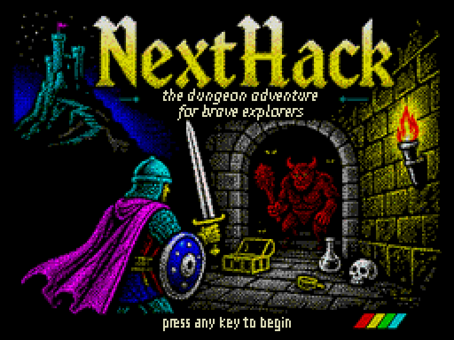
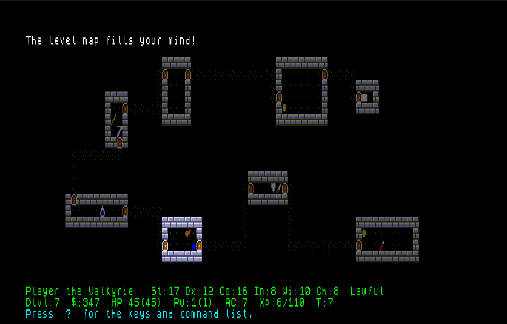
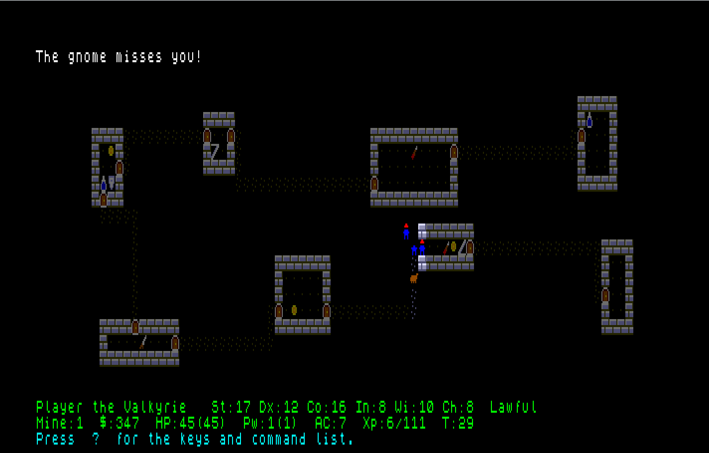
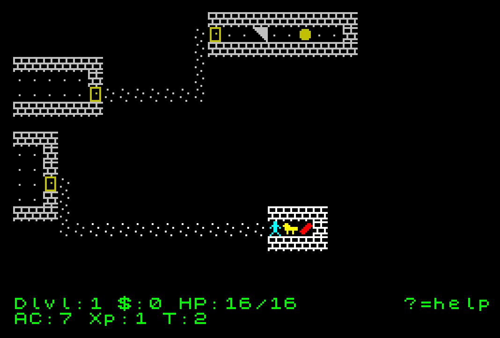
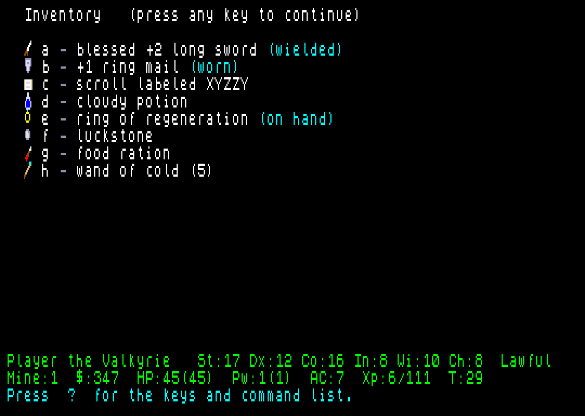

# NextHack — a NetHack-inspired roguelike for the ZX Spectrum Next & 128K

A from-scratch NetHack-style roguelike built with **Z88DK** (the `zsdcc`/SDCC C
compiler). **One codebase builds two targets:**

- the **ZX Spectrum Next** ([+zxn](https://www.specnext.com/)) — hardware tilemap,
  full-colour 8×8 tiles, Layer 2 title/victory art; tested on **ZEsarUX**;
- the plain **ZX Spectrum 128K** (+zx) — ULA display, 1-bit UDG tiles, an
  edge-scrolling 32-column viewport over the 80-wide map, and attribute-clash SCR
  loading screens; tested on **ZEsarUX**.

The two share **all** game logic; only the platform/render layer differs, selected
at compile time by `#ifdef __ZXNEXT`. Both are **code-banked** to break the Z80's
64 KB ceiling (the Next via its MMU, the 128K via port `0x7FFD`).

**Downloads & history:** grab the latest `.nex` / `.tap` from the
[Releases](https://github.com/lrrosa/nexthack/releases) page; see
[CHANGELOG.md](CHANGELOG.md) for what changed in each version.



*The title screen, on the Next's Layer 2 framebuffer (256×192); the 128K build
shows the same art as an attribute-clash SCR.*

## Strategy

This is a **fresh reimplementation** of NetHack's design in C, sized for the Z80N
— not a recompile of NetHack's source. The design reference is the NetHack **5.0
development version** (the branch long known as 3.7; the latest *stable* release is
3.6.7). You cannot just
compile the original: it is ~250k lines of C that assume 32-bit ints and
megabytes of flat RAM (5.0 even depends on Lua), while the Z80 only sees 64 KB at
a time. So the engine is rebuilt on a dedicated **Next platform layer** (display,
keyboard, sound), reusing NetHack's design, key bindings and feel rather than its
code.

## Features

- **Four classes** — every game asks *who are you?* The Valkyrie fights, the
  Wizard zaps, the Rogue dodges, the Tourist haggles — each with its own
  attributes (which really matter: St hits harder, Dx lands blows, Co mends,
  Ch bargains in shops), starting gear, purse and **alignment** (Lawful,
  Neutral or Chaotic — the god your offerings answer to).
- A **50-level dungeon**, generated procedurally and **deterministically**: each
  depth regenerates identically from its own seed, while the changes you make
  (gold taken, monsters killed, items picked up) are remembered across revisits
  — plus the **Gnomish Mines**, a four-level side branch off Dlvl 2 owned by
  gnomes and dwarves, gold-rich and capped by the luck-steadying **luckstone**.
  Items you drop **stay where you left them** (the last 8 levels' floors are
  remembered), so a stash by the stairs is a real strategy.
- **Field of view** with fog of war — rooms light up on entry, corridors reveal
  around you, and explored-but-unseen terrain is drawn dimmed from memory.
- **Turn-based combat** against a depth-scaled bestiary (rats, bats, kobolds,
  dogs, snakes, orcs, zombies, acid blobs, leprechauns, yellow lights, homunculi,
  wraiths, floating eyes — and deeper down, **trolls** that knit their wounds
  shut, life-draining **vampires**, **mimics** posing as items on the floor,
  and the apex **dragon**, which **breathes fire** down a clear corridor) that
  chases you with BFS pathfinding. Many bite with a
  **special attack** — poison, blindness, sleep, gold theft, life-drain — and
  never melee a floating eye with your eyes open. Hidden **traps** (trap doors,
  darts, sleeping gas) lurk in the deeper floors. Scratch **Elbereth** (`E`) in
  the dust to keep monsters at bay; experience levels raise your HP.
- **Corpses: you are what you eat** — slain monsters may leave one, and the
  right flesh teaches the body something: poison resistance, sleep resistance,
  or a floating eye's **telepathy** (sense every monster while blind).
- A **loyal pet dog** starts at your side, fights monsters for you, follows you
  through the dungeon — and **grows with its kills**, biting harder and taking
  more punishment. **Throw** (`t`) a weapon down a corridor for a ranged
  attack — it lands on the floor to be reclaimed — **search** (`s`) the ground for
  hidden traps, and **pray** (`p`) to your god to haul you out of trouble (best at
  an altar).
- **Items and equipment** — weapons, armour, potions, food, scrolls and rings,
  each with its own enchantment, erosion and **blessed/uncursed/cursed** state;
  potions and scrolls start **unidentified**. Wield/wear the best you carry,
  quaff/eat/read, watch acid blobs corrode your gear, beware cursed items that
  won't come off — then **enchant your gear** with the right scroll, **lift
  your curses** with another, bottle a whole **experience level**, or wear the
  **ring of regeneration** and mend twice as fast. **Wands** (`z`) zap magic
  in a chosen direction — a striking bolt, a freezing ray, sleep or
  teleport-away — or dig straight down a level.
- **Altars and divinity** — step onto an **altar** (`_`) to reveal the
  blessings on what you carry; drop an item on one and a flash names it, a
  potion taking the altar's own touch (holy water — or worse, on an altar of a
  crossed god). **Offer a corpse** (`d`) to a co-aligned god for real boons,
  and mind your hidden **luck**: pleased gods steady your sword arm, spurned
  ones stop hearing your prayers.
- **Spells and fountains** — read a **spellbook** (`&`) to learn its spell, then
  **cast** (`Z`) from your **spell power** (Pw): force bolt, healing, sleep, or
  teleport. **Fountains** (`{`) reward a thirsty adventurer with clear water,
  foul water or coins — and a worthy Valkyrie may draw **Excalibur** from one.
- **Shops** with priced goods and a shopkeeper to buy from and sell to, plus
  **special levels** — the cavernous Big Room, guarded **treasure vaults** (gold
  and superior gear behind tough monsters), and **hand-drawn maps** like a
  pillared temple, dropped in among the procedural floors.
- Hunger and slow HP regeneration, beeper sound effects, and **save & quit** to
  the SD card, NetHack-style (reloaded once on the next boot, then deleted — no
  save-scumming).
- **Death and glory** — a score screen on death or victory sums up your run
  (class, depth reached, turns, gold) and weighs it against the **best run so
  far**, which persists on disk between games — and it honours your
  **conducts**: Pacifist, Vegetarian, Illiterate, Atheist.
- The goal: retrieve the **Amulet of Yendor** from the bottom of the dungeon —
  past the **high priest** who guards it — and climb back out alive, through
  everything **Moloch** sends up after you (and he no longer takes your calls).



*Dlvl 7 after a scroll of magic mapping — rooms light up on entry, corridors reveal as you go, and gold, items and monsters share the floor. The status bar carries the whole character sheet, alignment included.*



*The Gnomish Mines (v0.10): gold-rich chambers, gnomes on the offensive — "The gnome misses you!" — and the luckstone waiting four levels down.*

## Project structure

The code is split into modules with clear responsibilities — the platform
(hardware) layer kept separate from the game logic. Because the engine
is **code-banked**, each module is also either **resident** (hot code
that stays mapped in, R) or **banked** (cold code paged into the `0xC000` window
on demand, B). Headers declare the interface; the `.c` is the R/B half. The
source files live in **`src/`**; the build scripts, `mmap.inc` and `zpragma.inc`
stay at the repo root (the build runs from there, where z88dk looks for `mmap.inc`).

The platform/render layer is **dual-target** via `#ifdef __ZXNEXT`: `platform.c`,
`platform_init.c` and `nexthack.c`'s renderer carry both the Next (tilemap /
Layer 2) and the 128K (ULA / UDG / SCR) code paths in one file, and the build
picks the right one. The 128K target adds `scr.c` (SCR blitter), `title_scr.c` /
`victory_scr.c` (const-banked SCRs) and `banked_call.asm` (the `0x7FFD`
trampoline); the Next target adds the `titlegfx*` / `victorygfx*` Layer 2 images.
The table below describes the **Next** build; the 128K build's modules are the
same minus the Layer 2 images.

| File | R/B | Responsibility |
|------|-----|----------------|
| `mainentry.c` | R | `main()` only: the turn loop / dispatcher (the CRT entry point) |
| `platform.c` / `.h` | R | hot ZX Next hardware: tilemap draw primitives, text/messages, keyboard, file I/O; palette tables |
| `platform_init.c` | B | one-time setup: tilemap/font/tile/palette init and the `gfx[]` graphic-tile table |
| `rng.c` / `.h` | R | random number generator (xorshift16) and the world seed |
| `level.c` / `.h` | R | terrain buffer and the per-cell leaves (terrain / walkable / tile lookup) |
| `levelgen.c` | B | procedural generation, special levels, gold/item persistence |
| `levelfov.c` | B | field of view (fog of war) and save/restore |
| `leveltmpl.c` | B | loader for the hand-drawn special-level templates |
| `monster.c` / `.h` | R | monster arrays, per-monster lookups and the bestiary |
| `monster_ai.c` | B | chase pathing (BFS), combat, spawning, kill persistence, the pet |
| `item.c` / `.h` | B | inventory and items (pick up, wield/wear/quaff/eat/read/put-on, throw) |
| `classes.c` / `.h` | B | the class picker and starting kits |
| `spells.c` / `.h` | B | spellbooks and spellcasting |
| `sfx.c` / `.h` | B | beeper sound effects |
| `nexthack.c` / `.h` | B | game-state globals (resident data), rendering, turn step, level orchestration, save/restore, screens |
| `game.h` | — | shared player/run state used across modules |

## Build

This repository contains **only the game source**. The toolchain and emulator are
external tools you install yourself; the build/run scripts expect them as sibling
folders of this one. The game is **code-banked** (>64 KB), which needs a recent
z88dk (the `__banked` trampoline, build v24836+):

```
<parent>/
├─ nexthack/        ← this repository
├─ z88dk/           ← z88dk SDK, a recent nightly (https://github.com/z88dk/z88dk)
└─ ZEsarUX/         ← the ZEsarUX emulator        (https://github.com/chernandezba/zesarux)
```

With that layout in place, `build.ps1` is the preferred build — incremental and
parallel, so it skips untouched modules and uses all cores (clean ~75 s, a
one-module edit ~25 s):

```powershell
.\build.ps1          # incremental + parallel build -> nexthack.nex
.\build.ps1 -Clean   # force a full rebuild
```

`build.bat` is the single-shot fallback (recompiles everything in one pass):

```bat
build.bat            REM builds the whole game (all modules) -> nexthack.nex
build.bat foo.c      REM builds a single .c file             -> foo.nex
```

Equivalent direct invocation of the full build:

```bat
set ZCCCFG=..\z88dk\lib\config\
set PATH=..\z88dk\bin;%PATH%
zcc +zxn -subtype=nex -vn -SO3 -clib=sdcc_iy --max-allocs-per-node200000 -startup=1 -pragma-include:zpragma.inc -m src/mainentry.c src/nexthack.c src/platform.c src/platform_init.c src/rng.c src/level.c src/levelgen.c src/levelfov.c src/monster.c src/monster_ai.c src/item.c src/sfx.c src/leveltmpl.c src/classes.c src/spells.c src/titlegfx0.c src/titlegfx1.c src/titlegfx2.c src/titlepal.c src/victorygfx0.c src/victorygfx1.c src/victorygfx2.c src/victorypal.c -o nexthack -create-app
```

The banking layout is configured by `zpragma.inc` (stack at `0xBFF0`, banking
segment 3) and `mmap.inc` (the `PAGE_20`/`PAGE_22`/`PAGE_26`/`PAGE_28`
code-page ORGs).

### Building the ZX Spectrum 128K target

The plain 128K build uses the classic `+zx` target with manual 16 KB bank paging
(port `0x7FFD`). It needs `..\ZEsarUX\` as a sibling folder to run.

```powershell
.\build-zx128.ps1          # incremental -> nexthack128.tap (+ a 128K nexthack128.sna)
.\build-zx128.ps1 -Clean   # force a full rebuild
```

It compiles the same modules (taking their `#else` 128K code paths) plus the ULA
SCR screens (`scr.c`, `title_scr.c`, `victory_scr.c`), the vendored `0x7FFD`
banking trampoline (`banked_call.asm`), the esxDOS-detection probe
(`esxdetect.asm`) and the hand-written ULA blits (`puttile_asm.asm`); the 96 KB
of Next Layer 2 image modules are dropped. Banking comes from `zpragma-zx128.inc` (the `CRT_ORG_BANK_N`
far-bank ORGs); `tools/png2scr.py` regenerates the title/victory SCRs from the
PNG art.

## Run the Next build

Both targets run in the **ZEsarUX** emulator (kept one dir up, in `..\ZEsarUX`).

```bat
run-next.bat         REM runs nexthack.nex in ZEsarUX (Next)
```

ZEsarUX auto-mounts esxDOS onto the folder holding the `.nex`, so **save/restore
works directly**: in game, `S` writes `nexthack.sav` beside the `.nex` and the
next boot reloads it — no SD card image or `hdfmonkey` needed.

## Run the ZX Spectrum 128K build

**`nexthack128.tap` is the distributable.** It is a standard tape that loads on
real 128K hardware and any accurate emulator (Spectaculator, Fuse, …): open it on
a 128K model and let it load. Its BASIC loader pages each 16 KB bank into place
via `0x7FFD`, then a small boot stub sets the interrupt mode before starting — so
it does not depend on esxDOS just to run.

```bat
run-zx128.bat        REM dev convenience: boots nexthack128.tap in ZEsarUX (--machine 128k)
```



*The same game on a plain 128K: 1-bit tiles on the ULA, a 32-column viewport that
edge-scrolls over the 80-wide map — "Your dog kills the rat!"*

`run-zx128.bat` launches **ZEsarUX** (sibling `..\ZEsarUX\`) for quick local
testing; it inserts the tape with `--tape`, so ZEsarUX auto-loads it straight to
the title (no boot-menu key). It also passes `--noconfigfile` so the shared
ZEsarUX config can't force the Next machine over the 128K.
Save/restore on the 128K needs an **esxDOS/DivMMC** interface, which the game
probes for at startup: with one, `S` writes `nexthack.sav` and it reloads on the
next boot; without one the game runs normally but cannot save. The build also
emits a `nexthack128.sna`, but it is **dead** — it boots the resident title then
crashes on the first banked call (it doesn't carry the code-banked RAM banks),
in ZEsarUX too. **Run and ship the `.tap`, not the `.sna`.**

## Controls

| Key                       | Action          |
|---------------------------|-----------------|
| cursor keys / `h j k l`   | move ◄ ▼ ▲ ► (hold to keep moving) |
| `y` `u` `b` `n`           | move diagonally |
| `>` `<` or `Enter`        | stairs down / up |
| `.` or Space              | wait a turn |
| `s`                       | search the ground for nearby hidden traps |
| `,`                       | pick up the item under you |
| `i`                       | show inventory |
| `d`                       | drop an item (sells it in a shop; offers a corpse on an altar) |
| `w` / `W`                 | wield weapon / wear armor |
| `P`                       | put on a ring |
| `q` / `e` / `r`           | quaff potion / eat food / read scroll |
| `t`                       | throw a weapon in a direction |
| `z`                       | zap a wand (strike, freeze, sleep, teleport, or dig down) |
| `Z`                       | cast a known spell (spends Pw) |
| `p`                       | pray to your god |
| `E`                       | engrave Elbereth in the dust (wards off monsters) |
| `S`                       | save game and quit to the title |
| `?`                       | show the full command list |

Walk into a monster to attack it; walk over gold to pick it up.



*The inventory screen (`i`): enchantment, blessed/cursed state, unidentified appearances, wand charges — the worn and wielded pieces flagged.*

## Map & item tiles

The world is drawn as colourful 8×8 pixel-art tiles, not ASCII text. The tiles and
the entities they depict (the symbol in parentheses is the internal map code, kept
from the roguelike tradition):

- **Terrain:** floor (`.`), corridor (`#`), wall (`-` `|`), door (`+`),
  stairs up/down (`<` `>`), a mine entrance (`v`), altar (`_`), fountain (`{`),
  a sprung trap (`^`)
- **Items:** gold (`$`), weapon (`)`), armor (`[`), potion (`!`), food (`%`),
  scroll (`?`), ring (`=`), wand (`/`), spellbook (`&`), the luckstone (`*`),
  the Amulet of Yendor (`"`)
- **Creatures:** hero and shopkeeper (`@`), rat (`r`), bat (`B`), acid blob (`a`),
  kobold (`k`), dog (`d`), snake (`S`), orc (`o`), zombie (`Z`), leprechaun (`l`),
  yellow light (`y`), homunculus (`i`), wraith (`W`), floating eye (`e`),
  troll (`T`), vampire (`V`), dragon (`D`), mimic (`m` — hidden ones wear an
  item's tile), gnome (`G`), dwarf (`h`), the high priest (`M`)

## Technical notes

- **Display**: the Next hardware tilemap (80×32). Glyphs are built at runtime by
  expanding the 1bpp ROM font at `0x3C00` into 4bpp tiles; per-cell colour comes
  from the tilemap palette (16 ink colours over a black paper). The ULA layer is
  disabled so only the tilemap is shown. Tile data lives in Bank 5
  (`0x4000` tiles, `0x6000` tilemap) — free because the program is at `0x8000+`.
- **`int` is 16-bit** in SDCC, so values that can exceed ±32767 (gold, the turn
  counter, bit flags) need care: `long` works but is slow, and 16-bit arithmetic
  must be audited for overflow.
- **Memory / code banking**: the engine outgrew the 64 KB the Z80 sees at once, so
  it is **code-banked** — a resident half (hot code + all data + stack in
  `0x8000-0xBFF0`) plus cold code in four 16 KB pages swapped into the `0xC000`
  window by z88dk's `__banked` trampoline. The BFS scratch arrays live in Bank 5's
  free tail. The resident half — where every module's *data* and string literals
  land by default — is the tightest budget; read-once tables and message strings
  are const-banked next to the code that reads them to stay under it.

## References

- **ZX Spectrum Next dev wiki (primary reference):** <https://wiki.specnext.dev/Main_Page>
  - Memory map (default config has 512 KB RAM): <https://wiki.specnext.dev/Memory_map>
- ZX Spectrum Next — Tilemap mode: <https://www.specnext.com/tilemap-mode/>
- ZX Spectrum Next — Sprites: <https://www.specnext.com/sprites/>
- NetHack: <https://www.nethack.org/>
- z88dk: <https://github.com/z88dk/z88dk>
- ZEsarUX emulator: <https://github.com/chernandezba/zesarux>

## License

Copyright © 2026 Leonardo Roman da Rosa

NextHack is free software, released under the **GNU General Public License,
version 3 or (at your option) any later version** (SPDX identifier
`GPL-3.0-or-later`). The full text of GPLv3 is in [LICENSE](LICENSE); for later
versions see <https://www.gnu.org/licenses/>.

It is an independent, from-scratch engine *inspired by* NetHack's design. It
contains no NetHack source code and is **not affiliated with or endorsed by** the
NetHack DevTeam; "NetHack" is mentioned only to credit the inspiration. Because the
codebase shares no code with NetHack, NetHack's own licence (the NGPL) does not
apply to it, leaving us free to license NextHack under the GPLv3.
